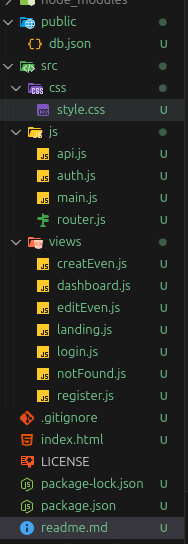

# SPA - Pet Care Center
This project is a Single Page Application (SPA) developed for an event management application designed to enable an event organizer to manage a series of events based on venue and attendee availability. This project includes the implementation of key features such as user authentication, secure path management, and session persistence, utilizing modern JavaScript, HTML5, and CSS technologies.

## Features
- Authentication and Roles: The system includes user registration and login functionalities. Access to features is protected and differentiated by roles admin and customer. 

## Technologies used

- HTML5
- CSS3 = no se alcanzo
- JavaScript Vanilla
- json-server

## File structure

## How to use

1. Clone this repository: git clone https://github.com/Jbarrazab/SPA_M3_prueba_desmpe-o.git

2. Open project and start in your code editort

4. Install Dependencies, npm i, np install json-server

5. Start app npm run dev, Start the api: npm run backend 

6. Open the Application npm run dev ➜  Local:   http://localhost:5173/

7. Test Credentials To facilitate testing, you can use the following credentials to log in as a worker (admin):

    email: juancho@admin.com
    password: admin123,
(user):
    email:jafit@mail.com
    password:123456789

## Future improvement
- The alerts.
- guardians.
- page not found.
- 

## Author Jafit emilio barraza barbosa

- Jafit emilio barraza barbosa
- Clan: Caiman
- Correo: jafitbarrazabarboasa@gmail.com
- User github:Jbarrazab
- Link repositorio: https://github.com/Jbarrazab/SPA_M3_prueba_desmpe-o.git